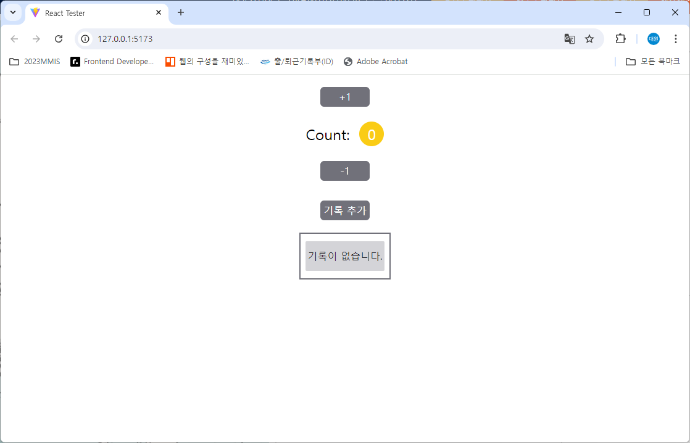

# LAB1: tutorial

## 만들 것

1. +1 버튼과 -1 버튼이 있는 카운터 프로그램을 만듭니다.
2. +1 버튼을 누르면 카운터가 1 증가하고, -1 버튼을 누르면 카운터가 1 감소합니다.

3. 카운터의 숫자를 기록할 수 있습니다.
4. 기록 추가 버튼을 클릭하면 기록에 추가됩니다.
5. 기록은 누적됩니다.

## Lab 세팅

1. `node >= 21`, corresponding `npm`
2. Lab 설치: `npm i`
3. Lab 개발: `npm run dev`
4. Lab 채점: `npm run test`