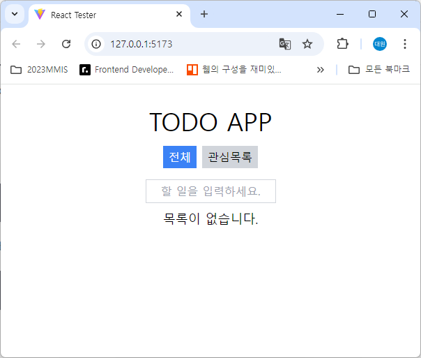
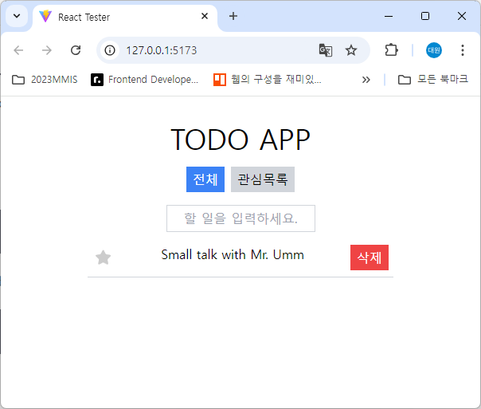
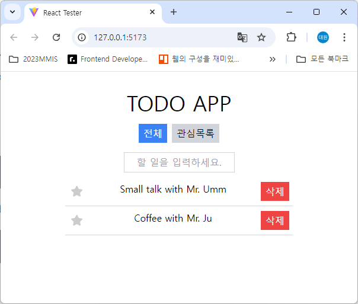
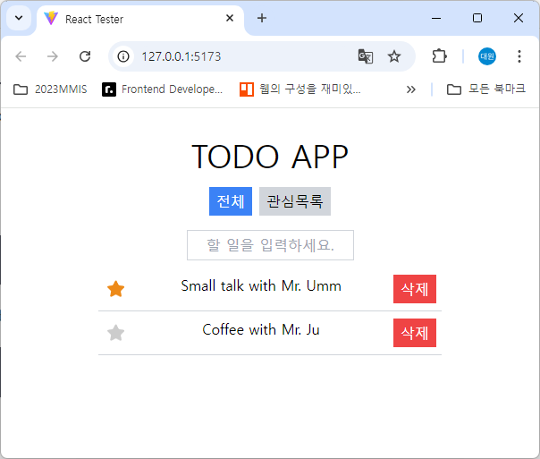
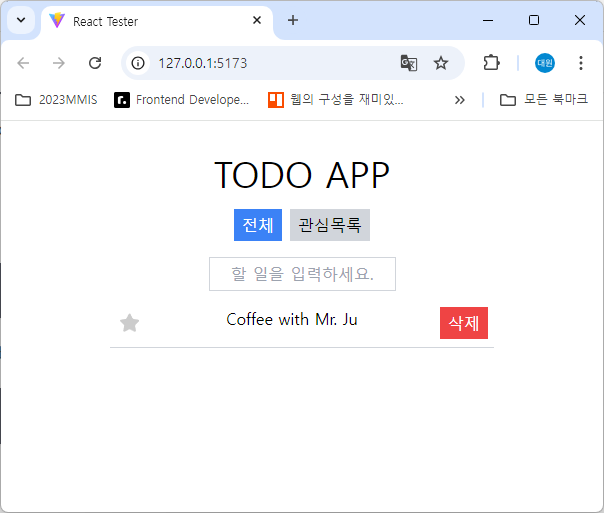

# LAB2: More On State

## Lab 세팅

1. node >= 21, corresponding npm
2. Lab 설치: npm i
3. Lab 개발: npm run dev
4. Lab 채점: npm run test

## 만들 것

1. 할 일 목록을 작성하고 즐겨찾기 추가 및 삭제할 수 있는 앱을 만듭니다.

2. 할 일을 작성하고 엔터 키를 누르면 즐겨찾기 목록에 추가됩니다.

3. 여러 개의 할 일을 작성할 수 있으며, 추가한 순서대로 위에서부터 정렬됩니다.

4. 별 버튼을 누르면 관심목록에 추가할 수 있고, 다시 누르면 관심목록에서 제거할 수 있습니다.

5. 전체 탭에서는 모든 할 일 목록을 보여주며, 관심목록에서는 관심목록에 추가된 할 일만 보여줍니다.

6. 삭제 버튼을 클릭하면 할 일 목록에서 삭제할 수 있습니다.

## 작업할 파일

* `src/App.tsx`
* `src/StyledButton.tsx`

## 총 점수

* 19점 만점의 점수를 받을 수 있습니다.

Happy Coding! :)